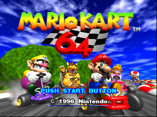
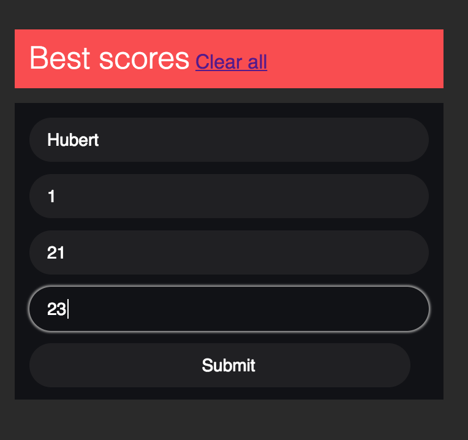
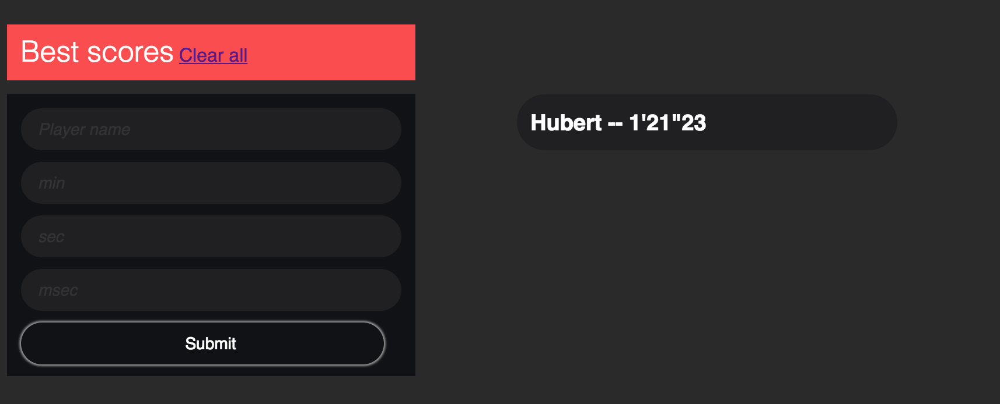
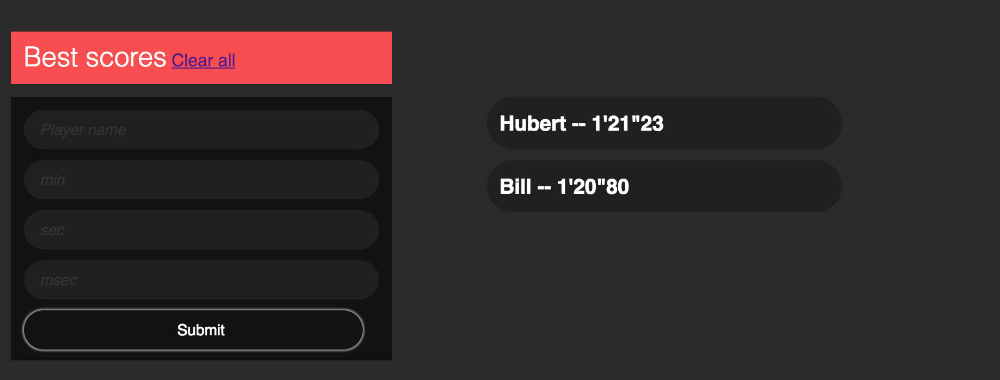
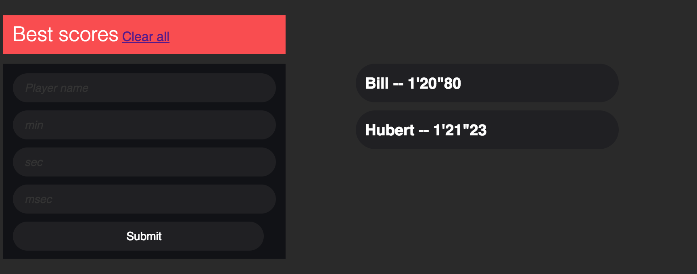
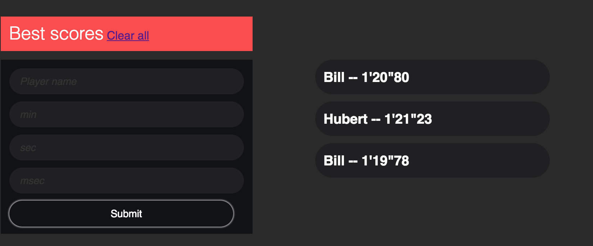
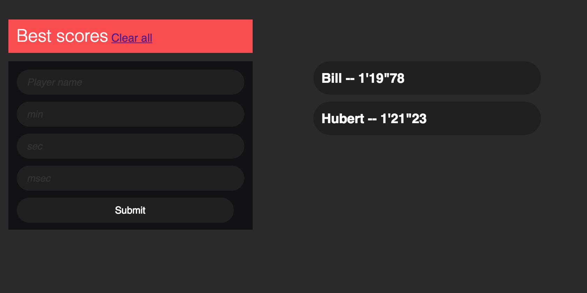

# MARIO KART 64 SCORES

## Intro

Salut à toi, l'ami. Tu vas utiliser ce site durant les portes ouvertes de l'EPFL
pour noter les scores des gens à Mario Kart 64 ! Ce guide va t'aider pour t'en
sortir (vu que c'est pas trop polissé ;)), mais si t'es en galère hésites pas à me contacter.

## Mode d'emploi

### Formulaire

Y'a un formulaire à remplir pour les gens qui ont joué. Il faut mettre :

* __nom__ : Ca peut être un nom / prénom / nom-prénom / mail / sciper peu importe tant que c'est toujours la même chose
* __min__ : Temps (minutes, >= 0)
* __sec__ : Temps (secondes, 0 <= t < 60)
* __msec__ : Temps (millisecondes, 0 <= t < 100)

S'il manque des trucs il y aura une alerte t'inquiètes !

### Liste des temps

Tu as la liste de tous gens qui ont participé, avec leur meilleur temps. L'ordre
est donné par le meilleur temps de chaque joueur.

Si tu as besoin d'enlever un joueur, tu peux cliquer sur son nom (**ATTENTION** pas `ctrl-z` ...).

**Note** : Lorsque quelqu'un rejoue et fait un meilleur score qu'avant, tu remplis
avec le même nom qu'avant, avec le nouveau temps. Ca va s'afficher tout en bas, il suffit de recharger la
page pour que tout revienne dans l'ordre des temps.

### Exemple

Tu remplis le formulaire.

Le score apparait dans la liste.

Un deuxième score apparait dans la liste, mais il est pas encore dans l'ordre !
On rafraichit.

Voilà, Bill est meilleur qu'Hubert.

Bill a fait un nouveau high score, mais pareil c'est pas encore filtré. On rafraichit !

Et voilà !

### FAQ

* *Les temps sont pas dans l'ordre*
> Rafraichis la page

* *Y'a un truc bizarre je sais pas comment ca marche ...*
> Envoie moi un mail

* *Qu'en pensez vous Arsène ?*
> #Oui

### Notes

Désolé c'est pas beau ... Si y'a des bugs dis moi je peux essayer de les corriger mais j'ai pas eu le temps de faire plus ...
